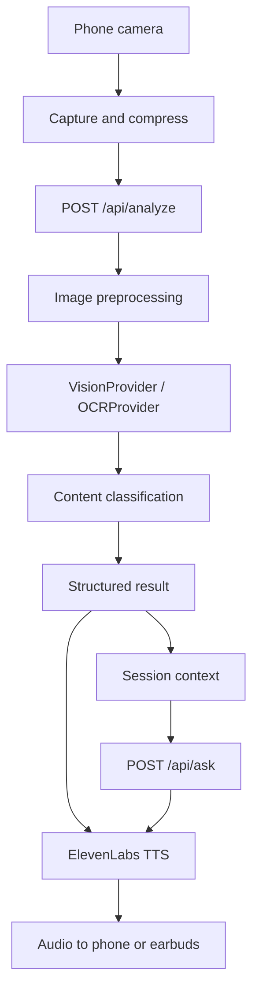
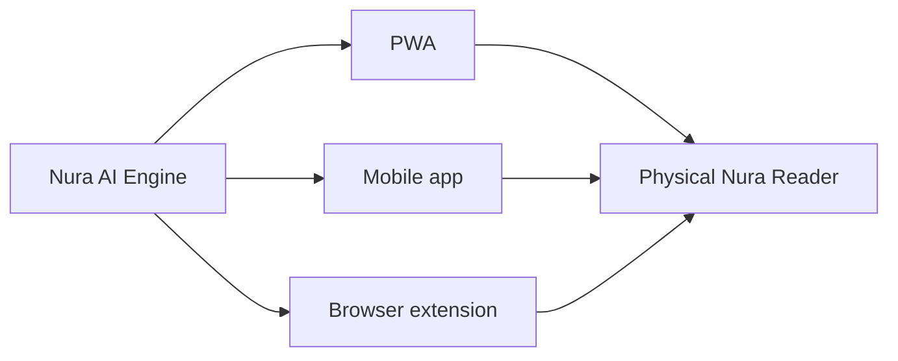

# Nura

**See it. Hear it. Understand it.**

Nura is an AI-powered visual screen reader designed for blind and visually impaired users. It makes visual information accessible through voice.

Point a phone camera at a book, sign, document, receipt, or Kenyan banknote. Nura captures it, reads it, understands what it means, and speaks the result. Follow-up questions use the current scan — no second capture required.

Nura is a **visual information accessibility system**. It is not a generic environmental assistant, navigator, or object detector.

---

## Problem

Printed text, signs, forms, and currency are inaccessible without sight. Existing camera apps often describe the scene ("there is a chair") instead of reading the information that actually matters.

## Solution

Nura answers one question:

> What visual information is here, and what does it mean?

The PWA is the first interface. The same backend APIs are designed so a future lightweight physical reader can call them without rewriting the intelligence layer.

## Features

- Camera capture with rear camera, torch, and image compression
- Reading modes: **Read**, **Currency (KES)**, **Sign**, **Document**, **Ask**
- Structured analysis (title, important fields, summary, spoken text)
- ElevenLabs text-to-speech and speech-to-text (Scribe) on the backend
- Short-term scan context for follow-up questions
- History, settings, offline shell, and PWA install
- User-facing errors only — no technical stack traces in the UI

## Architecture

```text
                         NURA
                 VISUAL ACCESS ENGINE
                          |
              +-----------+-----------+
              |           |           |
             OCR       VISION       CONTEXT
              |           |           |
              +-----------+-----------+
                          |
                    STRUCTURED DATA
                          |
                     AI RESPONSE
                          |
                  +-------+-------+
                  |               |
                 TEXT          ELEVENLABS
                                  |
                               AUDIO
```





Frontend and backend are loosely coupled over REST. Business logic lives in the API, not in React components.

## Tech stack

| Layer | Stack |
| --- | --- |
| Frontend | React, Vite, TypeScript, Tailwind CSS, PWA |
| Backend | Python, FastAPI, Pydantic, Uvicorn |
| Voice | ElevenLabs TTS + Scribe STT |
| Vision | Pluggable Gemini or OpenAI vision providers |

## Repository layout

```text
nura/
├── frontend/     React PWA
├── backend/      FastAPI visual engine
├── render.yaml
└── README.md
```

## Local setup

### Backend

```bash
cd nura/backend
python3 -m venv .venv
source .venv/bin/activate
pip install -r requirements.txt
cp .env.example .env
# add ELEVENLABS_API_KEY and AI_API_KEY
uvicorn app.main:app --host 0.0.0.0 --port 8000 --reload
```

### Frontend

```bash
cd nura/frontend
cp .env.example .env
npm install
npm run dev
```

If port 8000 is already in use, start the API on another port and set `VITE_API_URL` in `frontend/.env`.

Open `http://localhost:5173`. Vite proxies `/api` and `/health` to the backend when `VITE_API_URL` is empty.

### Tests

```bash
cd nura/backend && pytest
cd nura/frontend && npm test
```

## Environment variables

Copy `backend/.env.example`. Never commit `.env`.

| Variable | Purpose |
| --- | --- |
| `ELEVENLABS_API_KEY` | Server-only ElevenLabs key |
| `ELEVENLABS_VOICE_ID` | Voice used for spoken results |
| `ELEVENLABS_MODEL_ID` | Low-latency TTS model, default `eleven_flash_v2_5` |
| `AI_PROVIDER` | `gemini`, `openai`, or `none` |
| `AI_API_KEY` | Server-only vision provider key |
| `AI_MODEL` | Optional model override |
| `FRONTEND_URL` | Production PWA origin |
| `CORS_ORIGINS` | Comma-separated allowed origins |
| `VITE_API_URL` | Frontend build-time API base URL |

The ElevenLabs key is never sent to the browser.

## ElevenLabs setup

1. Create an ElevenLabs account and API key.
2. Choose a voice ID from the ElevenLabs dashboard.
3. Set `ELEVENLABS_MODEL_ID` to a low-latency model such as `eleven_flash_v2_5`.
4. Speech-to-text uses Scribe (`scribe_v2`) through `POST /api/stt` and `POST /api/ask`.

If TTS is unavailable, the PWA still shows the text result. Browser `SpeechSynthesis` is not used as the primary voice path.

## API

| Method | Path | Purpose |
| --- | --- | --- |
| GET | `/health` | `{ "status": "ok", "service": "nura-api" }` |
| GET | `/docs` | OpenAPI |
| POST | `/api/analyze` | General visual analysis |
| POST | `/api/read` | General reading |
| POST | `/api/currency` | Kenyan Shilling recognition |
| POST | `/api/sign` | Sign reading |
| POST | `/api/document` | Document understanding |
| POST | `/api/ask` | Follow-up question (text or audio) |
| POST | `/api/tts` | ElevenLabs speech |
| POST | `/api/stt` | ElevenLabs transcription |

Image and audio endpoints accept multipart uploads. Successful responses look like:

```json
{
  "success": true,
  "type": "document",
  "result": {
    "text": "...",
    "title": "University Admission Letter",
    "important_information": ["Admission confirmed"],
    "summary": "This is a university admission letter."
  },
  "audio": { "mime_type": "audio/mpeg", "base64": "..." },
  "confidence": 0.94
}
```

Send `X-Nura-Session` to keep scan context for Ask.

## Render deployment

`render.yaml` defines:

- **nura-api** — Uvicorn on `0.0.0.0:$PORT`
- **nura-pwa** — static Vite build

Set secrets in the Render dashboard. Production start command:

```bash
uvicorn app.main:app --host 0.0.0.0 --port $PORT
```

Point `VITE_API_URL` at the HTTPS API origin and add that PWA origin to `CORS_ORIGINS`.

## PWA installation

1. Open Nura in a supported mobile browser over HTTPS.
2. Use Add to Home Screen, or the in-app install prompt.
3. Grant camera (and microphone, for Ask).

When offline, Nura shows:

> Nura is offline. Previously saved content remains available, but visual analysis requires a connection.

Cloud vision and ElevenLabs are not simulated offline.

## Demo scenarios

1. **Book** — Point at a page, tap Read, hear the text.
2. **Street sign** — "The sign reads Kenyatta Avenue."
3. **KES note** — "This is a one thousand Kenyan shilling note."
4. **Document** — Identify the document, then ask "What's important?"
5. **Follow-up** — "When is the deadline?" using current scan context.

## Future hardware

Do not look for firmware in this repository. The phone camera and earbuds stand in for the eventual foldable reader. Hardware clients should call the same endpoints:

- `POST /api/analyze`
- `POST /api/ask`
- `POST /api/tts`

Providers (`VisionProvider`, `OCRProvider`, `CurrencyProvider`, `ContextProvider`, `SpeechProvider`) can be swapped without changing the PWA.
